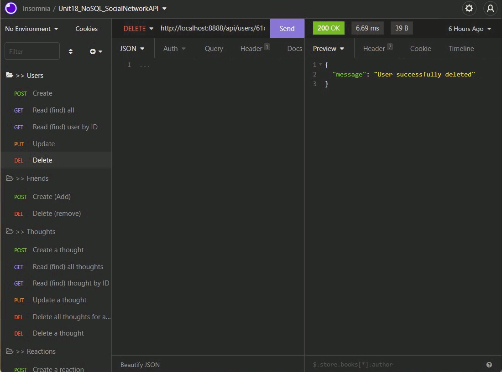
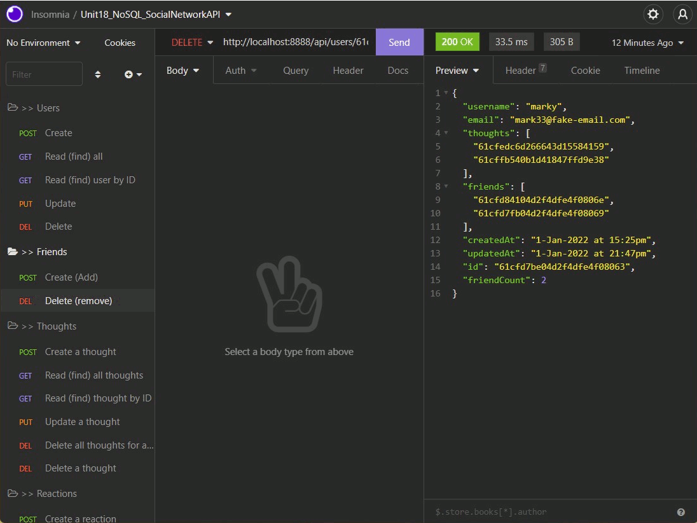
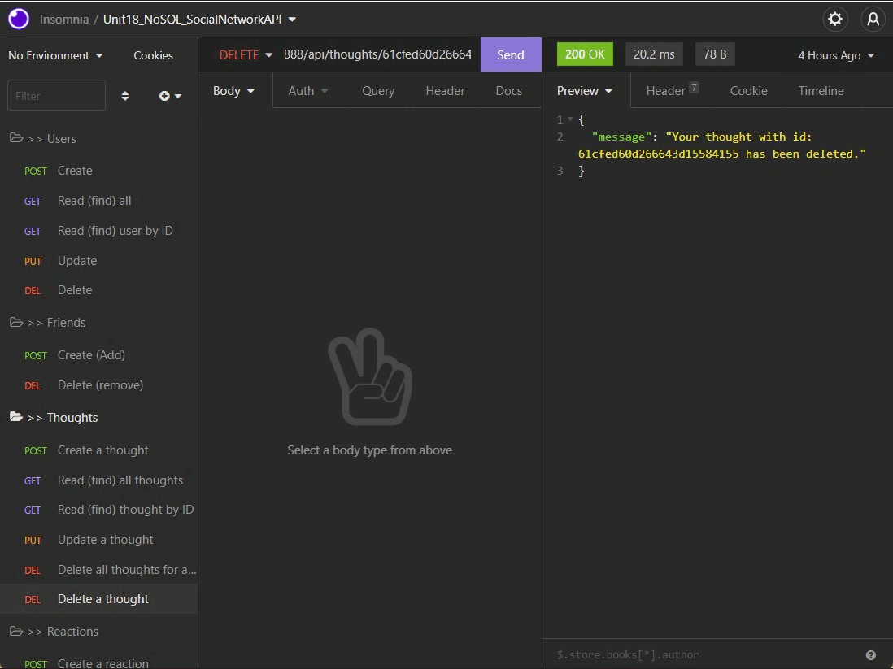
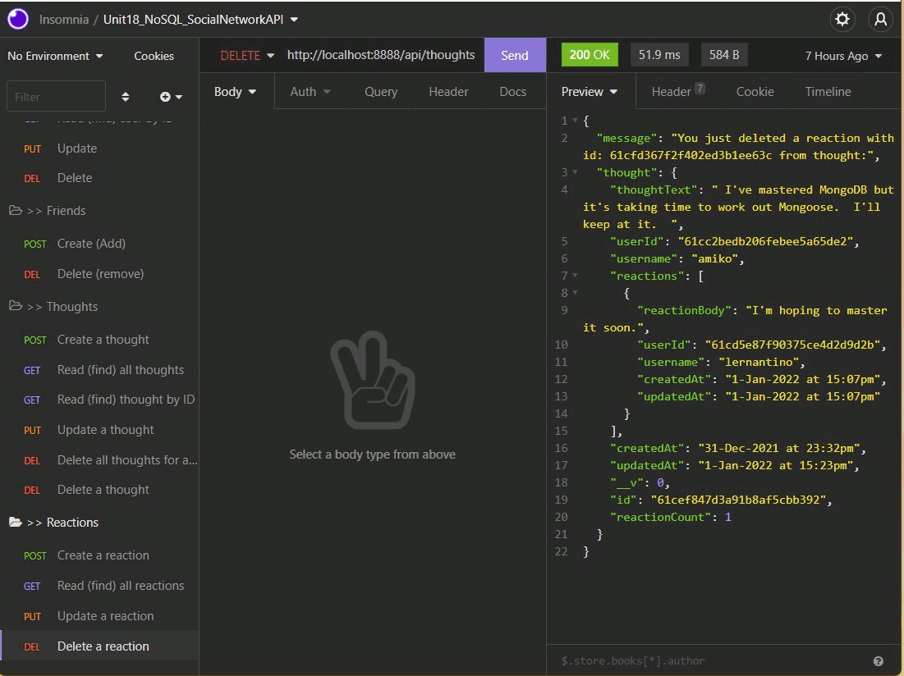

# USYD-FSF Week 18 Project

## Social Network API

### Table of Contents  
  
   1. [Project Description](#1-description)
   2. [Application Features](#2-features)
   3. [Installation](#3-installation)
   4. [Usage](#4-usage)
   5. [Credits](#5-credits)
   6. [License](#6-license)
   7. [Repository Status](#7-github-repo-status)
   8. [Contribute](#8-how-to-contribute)
   9. [Tests](#9-tests)
   10. [Checklist](#10-checklist)

---

### 1. Description  

**What is this project?**  

* An API for a social network application.  It is the server side and requires a client side if it is to be deployed for broader use.  Development testing of this code can be done using either Insomnia, Postman or another API platform.  

* Handling large amounts of unstructured data which would be expected in a successful social networking application is well suited to any of the non-relational (NoSQL) database packages.

**Why this project?**  

* Non-relational databases allow for very flexible and adaptable data models as opposed to relational databases.  This project uses MongoDB with Mongoose ODM, all very popular packages in non-relational database development.  

**What problem does this project solve?**  

* Provides an API, the engine, for a social network application that allows users to register, friend other users, create thoughts and react to other's thoughts.  

**Lessons learnt?**  

* We rapidly progressed from relational to non-relational databases.  I was completely unfamiliar with non-relational databases prior to commencing this course.  I've found it particularly challenging finding all the different methods and the different approaches for conditional querying.

* As always, when web searching for help, if your search request is not specific or consistent with the 'terminology' then a lot of time is spent trawling through information that is unhelpful.  I've provided the url in the code where I've discovered solutions to problems I was trying to find answers to.

---

### 2. Features  

* The application is invoked in the terminal with any of these commands: node index.js, nodemon index.js or npm start.  
* When the server is started, the Mongoose models are synced to the MongoDB database.  
* Opening an API GET route in Insomnia for users and thoughts provides the data for each of these routes, displayed in a formatted JSON.  
* Opening API POST, PUT, and DELETE routes in Insomnia successfully creates, updates, and deletes users and thoughts in the database.
* Opening API POST and DELETE routes in Insomnia successfully creates and deletes reactions to thoughts and adds and removes friends to a user’s friend list

A walkthrough video is available by clicking on this [link]( # )

Features of the application are shown in the following animated screengrabs of Insomnia that demonstrates the application's various API routes.  The routes are grouped as follows:

#### **Users**  

  

#### **Friends**  

  

#### **Thoughts**  

  

#### **Reactions**  

  


---

### 3. Installation

You are welcome to download the source code from [my Github repository](https://github.com/Mark33Mark/social-network-api)  

Please note, use of this code requires an API platform like [Insomnia](https://insomnia.rest/download) or [Postman](https://www.postman.com/downloads/).  

Once you have saved the code to your preferred location, you will also need to run:  ```npm install``` for dependencies to be downloaded.  

---

### 4. Usage  

The code can be downloaded from [my Github repository](https://github.com/Mark33Mark/social-network-api) for all assets created for the project.  
You can modify the code as you need.

---

### 5. Credits  

I've relied heavily on the online documentation for MongoDB and Mongoose for this work.  Where I've relied on other sites I've pasted the URL at the location of code where I've used the information.

---

### 6. License  

 The works in this repository are subject to:  

[](doc/LICENSE.md)

---

### 7. Github repo status  


---

### 8. How to Contribute  

 If you would like to contribute, please comply with the Contributor Covenant Code of Conduct:  

[](doc/code_of_conduct.md)

---

### 9. Tests  

* No unit tests have been written for this application.  

---

### 10. Checklist  

 All actions not checked are still to be completed:  

[x]  Github repository contains application code [Github location](https://github.com/Mark33Mark/social-network-api)  
[x]  Walkthrough video demonstrating the functionality of the social media API is available by clicking on this [link]( # ).  
[x]  The walkthrough video shows:  

*  all technical acceptance criteria being met.  
*  how to start the application's server.  
*  GET routes for all users and all thoughts.  
*  GET routes for a single user and a single thought.
*  POST, PUT and DELETE routes for users and thoughts.  
*  POST and DELETE routes for a user's friend list.
*  POST and DELETE routes for reactions to thoughts.  

[x]  The application is invoked in the terminal with any of these commands: node index.js, nodemon index.js or npm start.  
[x]  When the server is started, the Mongoose models are synced to the MongoDB database.  
[x]  Opening an API GET route in Insomnia for users and thoughts provides the data for each of these routes, displayed in a formatted JSON.  
[x]  Opening API POST, PUT, and DELETE routes in Insomnia successfully creates, updates, and deletes users and thoughts in the database.  
[x]  Opening API POST and DELETE routes in Insomnia successfully creates and deletes reactions to thoughts and adds and removes friends to a user’s friend list.  
[x]  Uses the Mongoose package to connect to a MongoDB database.
[x]  Includes User and Thought models outlined in the homework instructions.
[x]  Includes schema settings for User and Thought models as outlined in the homework instructions.
[x]  Includes Reactions as the reaction field’s subdocument schema in the Thought model.
[x]  Uses functionality to format queried timestamps properly.
[x]  BONUS - application deletes a user's associated thoughts when the user is deleted.  
[x]  Repository has a unique name; follows best practice for file structure; and naming conventions.  
[x]  Repsository follows best practices for class/id naming conventions, indentation, quality comments, etc.  
[x]  Repository contains multiple descriptive commit messages.  
[x]  Repository contains a README file with description, screenshots and link to a walkthrough video.  

---

[Back to the top](#usyd-fsf-week-18-project)  
